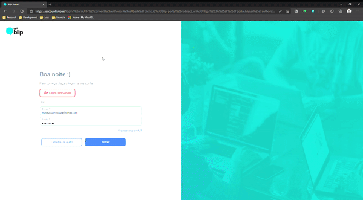

# Script to add users on [blip chatbot](https://portal.blip.ai/)



## What you need to use this script
1. Clone this repository
2. [Edit config file](#edit-config-file)
3. [Run with docker](#run-docker-image)
 
### <a name="edit-config-file">Edit config file</a>
Create a file with follow name **config.development.json** in [configuration folder](content/configuration). Copy the content from [config.json](content/configuration/config.json) and paste in your [development file](content/configuration/config.development.json).
 
In this file you will edit the values to execute the script. Follow the explain of the properties and values to insert in config file:
- **userInfo:** Values to get user that access the portal
    * mail: The email from the user that access the portal
    * password: The password from the user that access the portal
- **bots:** The bots identifier to insert the users
- **usersInsert:** The users information that will be insert in bots
    * mail: The email from user that will be have access
    * profile: The profile that this user is (Admin | Visualizar e editar | Visualizar)
 
### <a name="run-docker-image">Run with docker</a>
To run this app, you will need to have [Docker](https://www.docker.com/get-started) installed in your machine

With docker installed and configured, navigate to root folder of this project and execute the follow commands:
 
- Build this project using [Dockerfile](./Dockerfile) and create an image:
 
    ```
    docker build . -t imageName
    ```
- Run the image created:
 
    ```
    docker run imageName
    ```
 
**PS:** on above commands substitute the _**imageName**_ to the name that you want to give to your docker image